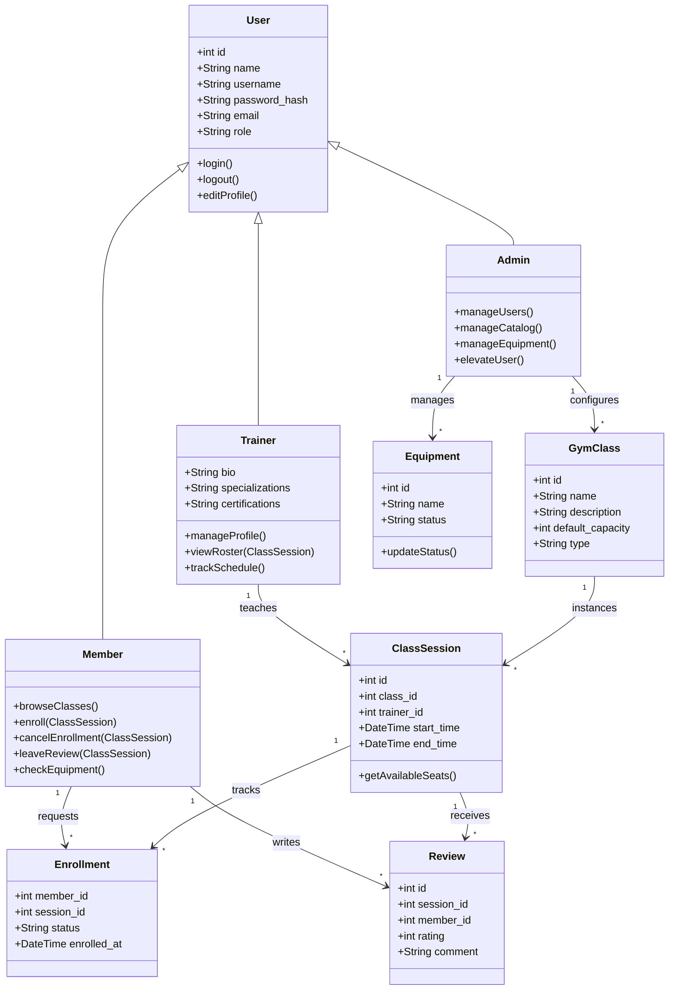

## How to view this diagram:
- Install **Markdown Preview Mermaid Support** extension for VS Code.
- Render this file using `Ctrl + Shift + V` (Windows)

## ER Diragram

```mermaid
classDiagram
    %% Core User & Roles
    class User {
        +int id
        +String name
        +String username
        +String password_hash
        +String email
        +String role
        +login()
        +logout()
        +editProfile()
    }

    class Member {
        +browseClasses()
        +enroll(ClassSession)
        +cancelEnrollment(ClassSession)
        +leaveReview(ClassSession)
        +checkEquipment()
    }

    class Trainer {
        +String bio
        +String specializations
        +String certifications
        +manageProfile()
        +viewRoster(ClassSession)
        +trackSchedule()
    }

    class Admin {
        +manageUsers()
        +manageCatalog()
        +manageEquipment()
        +elevateUser()
    }

    %% Inheritance: Member, Trainer, and Admin are specific types of Users
    User <|-- Member
    User <|-- Trainer
    User <|-- Admin

    %% Gym Entities
    class GymClass {
        +int id
        +String name
        +String description
        +int default_capacity
        +String type
    }

    class ClassSession {
        +int id
        +int class_id
        +int trainer_id
        +DateTime start_time
        +DateTime end_time
        +getAvailableSeats()
    }

    class Enrollment {
        +int member_id
        +int session_id
        +String status
        +DateTime enrolled_at
    }

    class Equipment {
        +int id
        +String name
        +String status
        +updateStatus()
    }

    class Review {
        +int id
        +int session_id
        +int member_id
        +int rating
        +String comment
    }

    %% Relationships
    Trainer "1" --> "*" ClassSession : teaches
    GymClass "1" --> "*" ClassSession : instances
    Member "1" --> "*" Enrollment : requests
    ClassSession "1" --> "*" Enrollment : tracks
    Member "1" --> "*" Review : writes
    ClassSession "1" --> "*" Review : receives
    Admin "1" --> "*" Equipment : manages
    Admin "1" --> "*" GymClass : configures
```